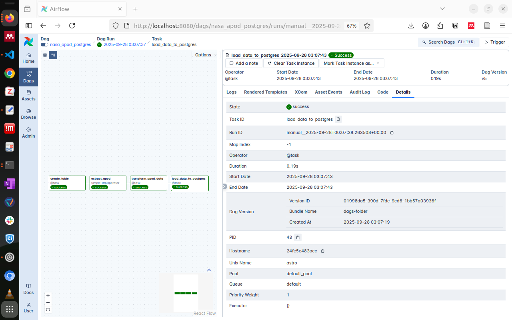

# 🚀 Airflow ETL Pipeline with Postgres & NASA API

## 📌 Project Overview
This project demonstrates how to build an **ETL (Extract, Transform, Load) pipeline** using **Apache Airflow**, with data sourced from NASA’s **Astronomy Picture of the Day (APOD) API** and stored in a **PostgreSQL** database.  

Airflow handles the orchestration of the workflow—scheduling, monitoring, and managing tasks—while **Docker** ensures a consistent and reproducible environment by running Airflow and Postgres as services.  

---

## 🔑 Key Components

### 🌀 Airflow (Workflow Orchestration)
- Defines, schedules, and monitors the ETL process.  
- Uses a **DAG (Directed Acyclic Graph)** to manage task dependencies and ensure sequential execution.  
- Tasks include **extracting**, **transforming**, and **loading** data.  

### 🗄️ PostgreSQL (Data Storage)
- Stores the processed astronomy data.  
- Runs in a **Docker container** with data persistence through volumes.  
- Integrated with Airflow using **PostgresHook** and **PostgresOperator**.  

### 🌌 NASA APOD API (Data Source)
- Provides astronomy metadata: **title, description, date, and image URL**.  
- Data is retrieved via Airflow’s **SimpleHttpOperator**.  

---

## 🏗️ Architecture & Workflow
The ETL process is implemented as an Airflow **DAG** with three stages:

1. **Extract (E)**  
   - Use `SimpleHttpOperator` to send HTTP GET requests to the NASA APOD API.  
   - Retrieve JSON responses with astronomy metadata.  

2. **Transform (T)**  
   - Process the JSON response with Airflow’s **TaskFlow API** (`@task`).  
   - Extract required fields and prepare them for database insertion.  

3. **Load (L)**  
   - Insert data into PostgreSQL using **PostgresHook**.  
   - Create the table if it doesn’t exist, ensuring smooth ingestion.  

---

⚡ With this pipeline, you get a **fully automated system** that fetches, cleans, and stores astronomy data daily—ready for reporting, visualization, or further analysis.  

### Airflow server 

